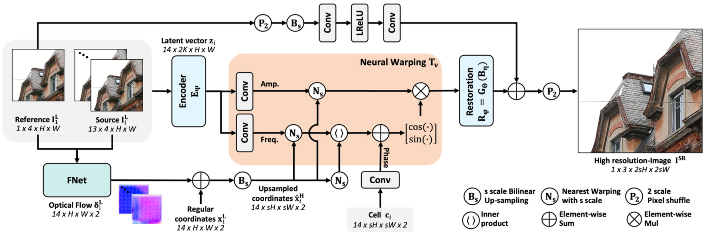
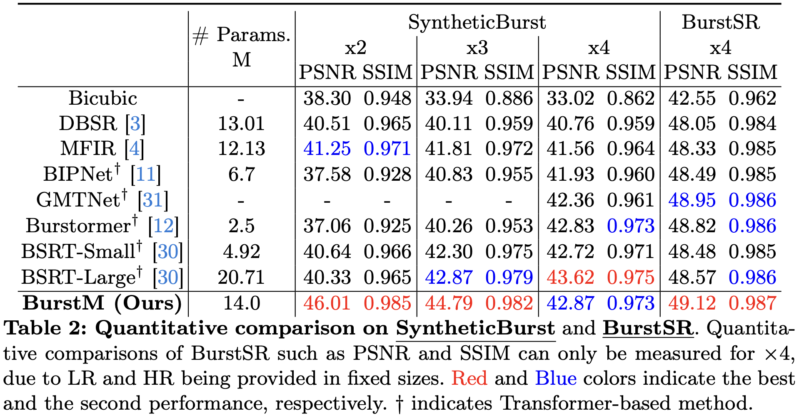
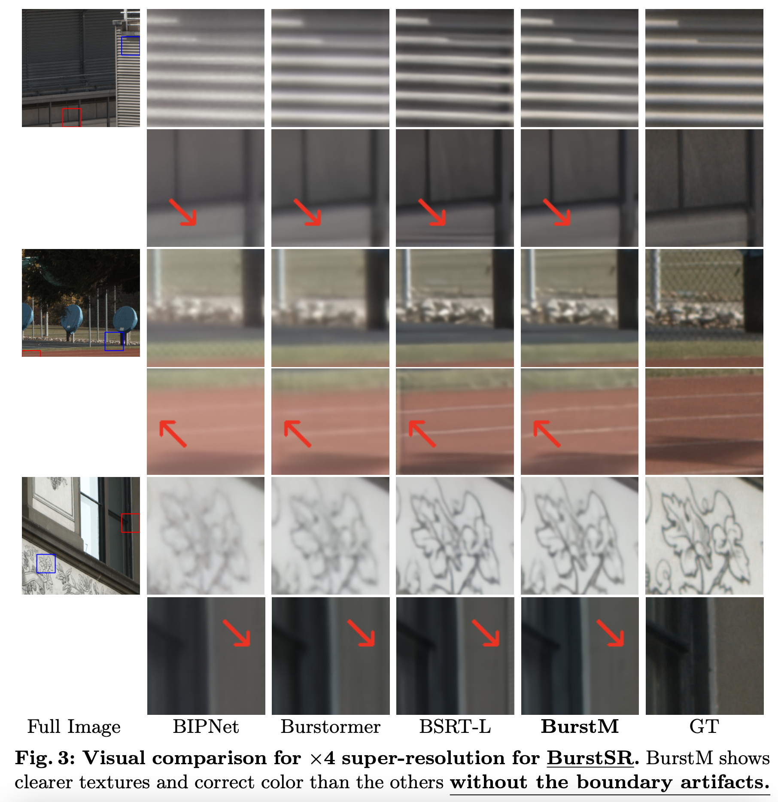
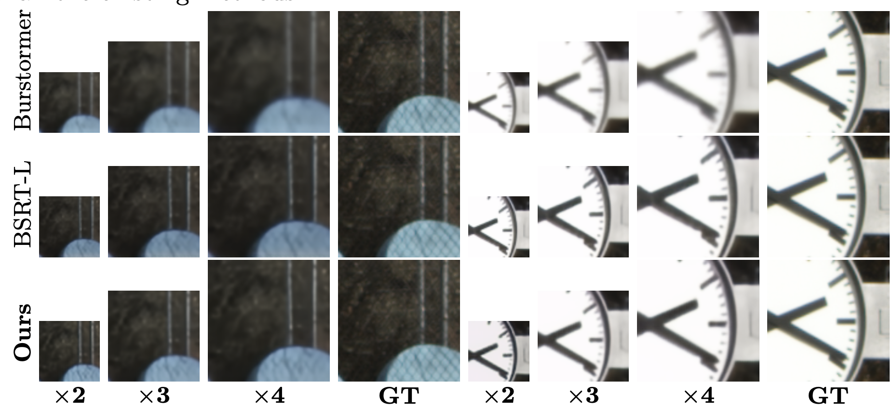

# BurstM: Deep Burst Multi-scale SR using Fourier Space with Optical Flow (ECCV 2024)

[EungGu Kang], [Byeonghun Lee], [Sunghoon Im], [Kyong Hwan Jin]

[](https://arxiv.org/pdf/2304.01194.pdf)

#### News
- **July 01, 2024:** Paper accepted at ECCV 2024 :tada:

<hr />

> *Multiframesuper-resolution(MFSR)achieveshigherperfor- mance than single image super-resolution (SISR), because MFSR lever- ages abundant information from multiple frames. Recent MFSR ap- proaches adapt the deformable convolution network (DCN) to align the frames. However, the existing MFSR suffers from misalignments between the reference and source frames due to the limitations of DCN, such as small receptive fields and the predefined number of kernels. From these problems, existing MFSR approaches struggle to represent high- frequency information. To this end, we propose Deep Burst Multi-scale SR using Fourier Space with Optical Flow (BurstM). The proposed method estimates the optical flow offset for accurate alignment and pre- dicts the continuous Fourier coefficient of each frame for representing high-frequency textures. In addition, we have enhanced the network’s flexibility by supporting various super-resolution (SR) scale factors with the unimodel. We demonstrate that our method has the highest perfor- mance and flexibility than the existing MFSR methods.*
<hr />

## Overall architectures for BurstM



## Comparison with previous models
### Quantitative comparison


### x4 inference result for BurstSR


### Multi-scale inference result for BurstSR



## Dependencies
- OS: Ubuntu 22.04
- nvidia cuda: 12.4
- Python: 3.10.14
- pytorch: 2.3.0

We used NVIDIA RTX 3090 24GB, sm86

We recommend using [conda](https://www.anaconda.com/distribution/) for installation:
```
conda env create --file environment.yaml
conda activate BurstM
```

## Training

### SyntheticBurst
1. Download dataset(Zurich RAW to RGB dataset) [Download](http://people.ee.ethz.ch/~ihnatova/pynet.html#dataset).

2. Train

```
# Please modify the path of input directory
CUDA_VISIBLE_DEVICES=0,1,2,3 python BurstM_Track_1_train.py --image_dir=<Input DIR>
```

### BurstSR(Real-world data)
1. Download dataset(BurstSR for real-world datasets) [Download](https://data.vision.ee.ethz.ch/bhatg/BurstSRChallenge/val.zip)

2. Train

```
# Please modify the path of input directory
CUDA_VISIBLE_DEVICES=0,1,2,3 python BurstM_Track_2_train.py --image_dir=<Input DIR> --pre_trained=<Pretrained model of SyntheticBurst>
```

## Test

### SyntheticBurst
1. Download pre-trained models of SyntheticBurst [Download](https://drive.google.com/file/d/1ToKrtGUhUHm8yHnZvgVuUmVwXlN064as/view?usp=sharing).

2. Test

  If you want to change the super-resolution scale, please change --scale.
  Not only intager scales, but also floating scales are possible.
  But the qualities of floating sclae such as x2.5 and x3.5 are not guaranteed.
```
# Please modify the path of iamge directory for inputs and pre-trained models(weights).
CUDA_VISIBLE_DEVICES=0 python BurstM_Track_1_evaluation.py --image_dir=<Input DIR> --scale=4, --weights=<Pretrained model of SyntheticBurst>
```


### BurstSR(Real-world data)
1. Download pre-trained models of BurstSR [Download](https://drive.google.com/file/d/1id83q_IOF7qawO5_4WJ4ZGOFvxkcwbFw/view?usp=sharing)

2. Test

  If you want to change the super-resolution scale, please change --scale.
  Not only intager scales, but also floating scales are possible.
  But the qualities of floating sclae such as x2.5 and x3.5 are not guaranteed.
```
# Please modify the path of iamge directory for inputs and pre-trained models(weights).
CUDA_VISIBLE_DEVICES=0 python BurstM_Track_2_evaluation.py --image_dir=<Input DIR> --scale=4, --weights=<Pretrained model of BurstSR>
``` 

## Citations
If our code helps your research or work, please consider citing our paper.
The following is a BibTeX reference.

```
Will be updated
```

## Contact
email: [eunggukang@gmail.com]